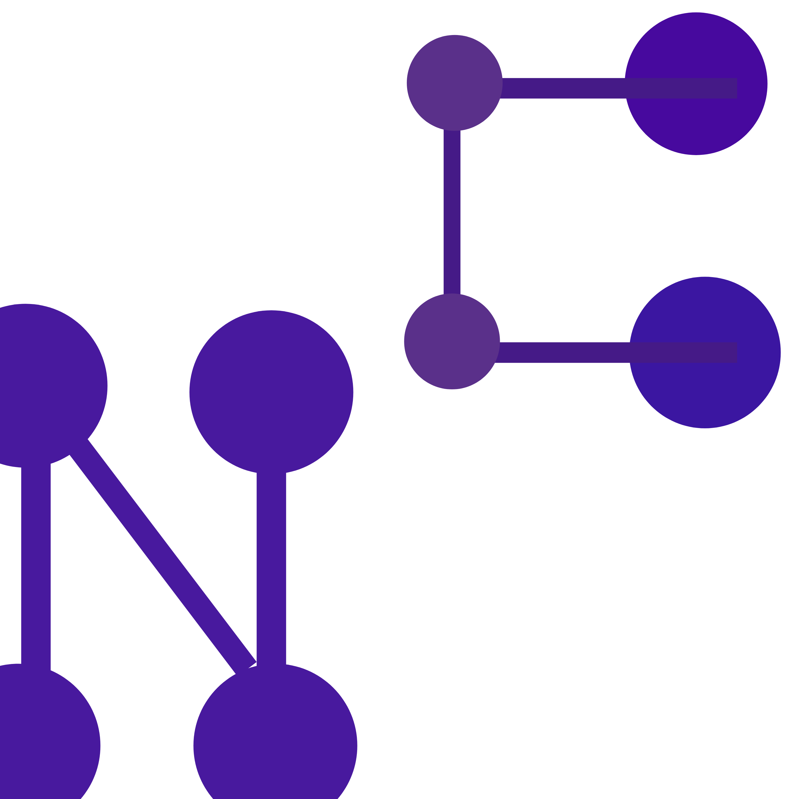

# NC Language - NuclearCloud Language



> © 2026 NWL-Systems — Criado por NWL-Systems

NC Language é uma linguagem de programação open source criada pela **NWL-Systems** como parte do projeto **NuclearCloud OS**.

---

## Instalação

### Linux / Mac / Android (Termux)
```bash
git clone https://github.com/NWL-Systems/nc-language.git
cd nc-language
clang -o nclang nc_compiler.c -lm
ln -s nclang nuclearcloud
```

---

## Hello World

```nc
say = "Hello World!"
```

```bash
nclang hello.nc
# Saída: Hello World!
```

Facilidade na Construção de Codigo

---

## Sintaxe

```nc
!# Comentário #!

!# Variáveis #!
!num!    x = 10
!numD!   altura = 1.75
!numF!   preco = 9.99
!fra!    nome = "NuclearCloud"
!sintax! ativo = !A

!# Saída #!
say = "Texto direto"
!! nome

!# Input #!
!fra! resposta
!ask! "Qual seu nome?" -> resposta
!! resposta

!# Condicional #!
!if! ativo == 1
say = "Sistema ativo!"
]
!elif! ativo == 0
say = "Sistema inativo!"
]
!else! Indefinido

!# Loop #!
!loop! 3 [
say = "Repetindo!"
]

!# While #!
!while! x > 0 [
!! x
x = x - 1
]

!# Função #!
!func! saudacao() [
say = "Ola do NC!"
]
!jun! saudacao

!# Função com retorno #!
!funcret! int soma(int a, int b) [
!ret! a + b
]

!# Classe #!
MinhaClasse nClass()[
say = "Dentro da classe!"
]

!# Importar #!
!use! NCD.connection
```

---

## Tipos

| Sintaxe | Tipo | Exemplo |
|---------|------|---------|
| `!num!` | Inteiro | `!num! x = 10` |
| `!numD!` | Decimal | `!numD! pi = 3.14` |
| `!numF!` | Fração | `!numF! n = 1.5` |
| `!fra!` | Texto | `!fra! nome = "NC"` |
| `!sintax!` | Booleano | `!sintax! ok = !A` |

## Booleanos

| Sintaxe | Valor |
|---------|-------|
| `!A` ou `true` | Verdadeiro |
| `!2` ou `false` | Falso |

---

## Comandos

| Sintaxe | Descrição |
|---------|-----------|
| `say = "texto"` | Imprime texto |
| `!! variavel` | Imprime variável |
| `!ask! "msg" -> var` | Input do usuário |
| `!if!` / `!elif!` / `!else!` / `]` | Condicional |
| `!loop! N [` | Repete N vezes |
| `!while! cond [` | Loop condicional |
| `!func! nome() [` | Declara função |
| `!funcret! tipo nome() [` | Função com retorno |
| `!jun! nome` | Chama função/arquivo |
| `!ret! valor` | Return |
| `!stop!` | Break |
| `!skip!` | Continue |
| `!# comentário` | Comentário |
| `nClass()[` | Classe |
| `!use! biblioteca` | Importar |

---

## Bibliotecas

A única biblioteca oficial é:

```nc
!use! NCD.connection
```

Para criar sua própria biblioteca use `.ncli`:

```nc
!# MinhaLib.ncli #!
MinhaClasse nClass()[
say = "Minha biblioteca NC!"
]
```

```bash
nclang MinhaLib.ncli
```

---

## NuclearCloud OS — Extensões

NC Language é a linguagem oficial do **NuclearCloud OS**. Todos os apps são criados em NC:

```bash
# App normal
nclang meuapp.nc meuapp.ncapp

# App de desenvolvedor
nclang terminal.nc terminal.ncdevapp

# App especial
nclang settings.nc settings.ncprivapp
```

Veja mais em: [nc-os-extensions-files](https://github.com/NWL-Systems/nc-os-extensions-files)

---

## Licença

Open source — use à vontade em qualquer projeto!
Único requisito: creditar **"NC Language criada por NWL-Systems"**

Veja [LICENSE](LICENSE) e [COPYRIGHT](COPYRIGHT).

---

**© 2026 NWL-Systems — NC Language é livre, mas o crédito é nosso.**
