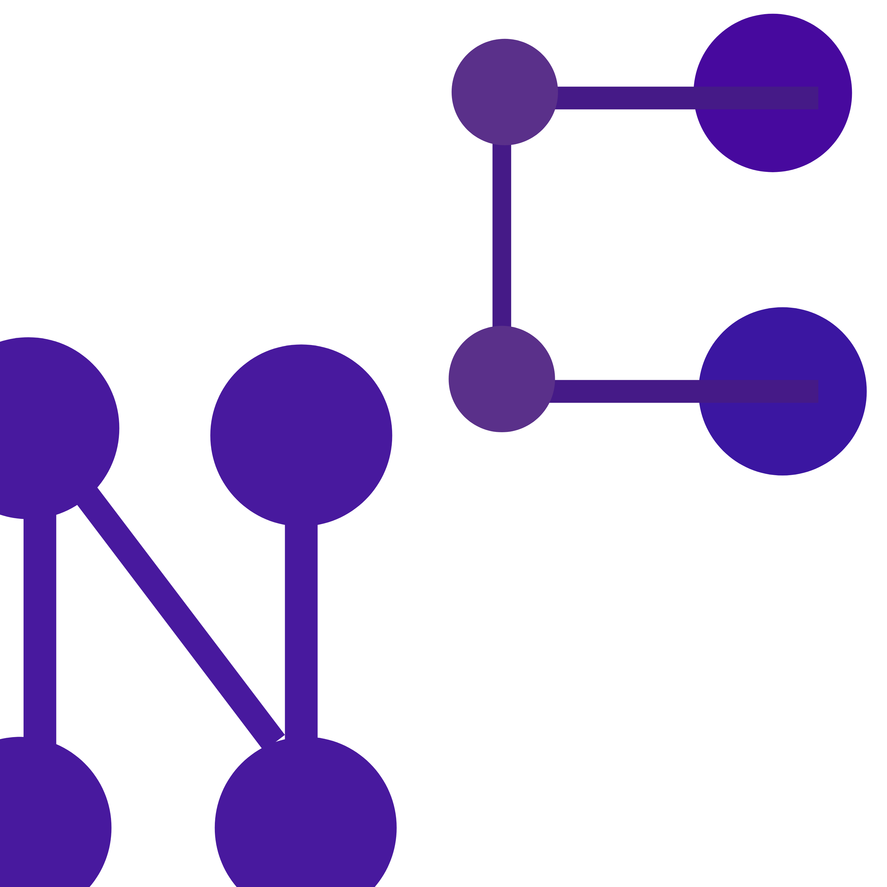

# NuclearCloud NC Language



> © 2026 NWL-Systems — Criado por NWL-Systems

Repositório unificado dos dois projetos que compõem a linguagem e o
ecossistema de apps do **NuclearCloud OS**:

- **[`nc-language`](https://github.com/NWL-Systems/nc-language)** — o compilador da NC Language (`nclang`) e o suporte de sintaxe pra editores.
- **[`nc-os-extensions-files`](https://github.com/NWL-Systems/nc-os-extensions-files)** — as extensões de arquivo do NuclearCloud OS (`.ncapp`, `.ncdocs`, etc.) e o módulo de sistema de arquivos (NCFS).

Esta versão junta os dois em um só lugar, corrige os bugs encontrados em
ambos (detalhes no [CHANGELOG.md](CHANGELOG.md)) e adiciona um build único
pra tudo.

---

## Estrutura do repositório

```
nuclearcloud-nc-language/
├── build_all.sh              # compila tudo (nclang, nc-cmd, nc_setup) de uma vez
├── update.sh                  # atualiza o repo local (git pull) e recompila
├── android/                   # app Android "NC Terminal" (Kivy + binarios nativos)
│   ├── main.py
│   ├── buildozer.spec
│   ├── build_native_libs.sh
│   └── README.md
├── .github/workflows/
│   └── macos-build.yml       # builda nclang/nc-cmd/nc_setup nativo no macOS
├── compiler/
│   ├── nc_compiler.c         # o compilador da NC Language (nclang)
│   └── nc-cmd.c               # shell interativo da NC Language
├── extensions/
│   ├── filemanager.nc         # app de exemplo (.ncapp) usando !ls! !mkdir! !write!
│   ├── mylib.ncli             # exemplo de biblioteca NC
│   └── fs/
│       ├── nc_fs.h / nc_fs.c  # NCFS - sistema de arquivos do NuclearCloud OS
│       └── nc_setup.c         # cria a estrutura de pastas do NuclearCloud OS
├── language-tools/
│   ├── hello.nc
│   ├── nc.tmLanguage.json     # grammar TextMate (syntax highlight)
│   ├── language-configuration.json
│   ├── languages.yml          # entrada pro GitHub Linguist
│   ├── package.json           # extensão de VS Code
│   └── icon.png
└── packages/
    └── ncgraphics.ncpkg       # exemplo de pacote instalavel (nclang --install-pkg)
```

---

## Instalação e build

### Linux / Android (Termux)
```bash
git clone https://github.com/NWL-Systems/nuclearcloud-nc-language.git
cd nuclearcloud-nc-language
./build_all.sh
```

O script detecta automaticamente `clang` (Termux/Mac) ou `gcc`/`cc` (Linux)
e gera tudo em `bin/`:

- `bin/nclang` (+ symlink `bin/nuclearcloud`) — o compilador/executor da NC Language
- `bin/nc-cmd` — shell interativo
- `bin/nc_setup` — cria a estrutura de pastas do NuclearCloud OS

Pra instalar globalmente:
```bash
# Termux
cp bin/nclang $PREFIX/bin/nclang
ln -sf $PREFIX/bin/nclang $PREFIX/bin/nuclearcloud

# Linux/Mac com sudo
sudo cp bin/nclang /usr/local/bin/nclang
sudo ln -sf /usr/local/bin/nclang /usr/local/bin/nuclearcloud
```

### Windows
Precisa de MinGW (`sudo apt install mingw-w64` no Linux, ou compilar direto
no Windows com `clang`/`gcc`). O `build_all.sh` detecta o MinGW
automaticamente se disponível; senão, compile manualmente:
```bash
clang -o nclang.exe compiler/nc_compiler.c -lm
```

---

## Hello World

```nc
say = "Hello World!"
```

```bash
bin/nclang language-tools/hello.nc
```

---

## Sintaxe da NC Language

```nc
!# Comentário #!

!# Variáveis #!
!num!    x = 10
!numD!   altura = 1.75
!numF!   preco = 9.99
!fra!    nome = "NuclearCloud"
!sintax! ativo = !A

!# Saída #!
say = "Texto direto"
!! nome

!# Input #!
!fra! resposta
!ask! "Qual seu nome?" -> resposta
!! resposta

!# Condicional (cada bloco termina com "]") #!
!if! ativo == 1
say = "Sistema ativo!"
]
!elif! ativo == 0
say = "Sistema inativo!"
]
!else!
say = "Indefinido"
]

!# Loop #!
!loop! 3 [
say = "Repetindo!"
]

!# While #!
!while! x > 0 [
!! x
x = x - 1
]

!# Função #!
!func! saudacao() [
say = "Ola do NC!"
]
!jun! saudacao

!# Função com retorno #!
!funcret! int soma(int a, int b) [
!ret! a + b
]

!# Classe #!
MinhaClasse nClass()[
say = "Dentro da classe!"
]

!# Importar #!
!use! NCD.connection
```

### Tipos

| Sintaxe | Tipo | Exemplo |
|---------|------|---------|
| `!num!` | Inteiro | `!num! x = 10` |
| `!numD!` | Decimal | `!numD! pi = 3.14` |
| `!numF!` | Fração | `!numF! n = 1.5` |
| `!fra!` | Texto | `!fra! nome = "NC"` |
| `!sintax!` | Booleano | `!sintax! ok = !A` |

### Booleanos

| Sintaxe | Valor |
|---------|-------|
| `!A` ou `true` | Verdadeiro |
| `!2` ou `false` | Falso |

### Comandos

| Sintaxe | Descrição |
|---------|-----------|
| `say = "texto"` | Imprime texto |
| `!! variavel` | Imprime variável |
| `!ask! "msg" -> var` | Input do usuário (aceita frases com espaço) |
| `!if!` / `!elif!` / `!else!` / `]` | Condicional — cada bloco fecha com `]` |
| `!loop! N [` | Repete N vezes |
| `!while! cond [` | Loop condicional |
| `!func! nome() [` | Declara função |
| `!funcret! tipo nome() [` | Função com retorno |
| `!jun! nome` | Chama função/arquivo |
| `!ret! valor` | Return |
| `!stop!` | Break |
| `!skip!` | Continue |
| `!mkdir! nome` | Cria uma pasta (aceita `"literal"` ou variável) |
| `!write! arquivo, conteudo` | Escreve conteúdo num arquivo (idem) |
| `!ls! caminho` | Lista o conteúdo de uma pasta (idem) |
| `!pkg! nome_pacote` | Instala um pacote, detectando a plataforma certa (veja abaixo) |
| `!# comentário` | Comentário |
| `nClass()[` | Classe |
| `!use! biblioteca` | Importar |

### `!pkg!` — instalar pacotes detectando a plataforma

```nc
!pkg! "cowsay"
```

O binário compilado já sabe qual gerenciador de pacotes usar, sem precisar
de nenhuma configuração:

| Onde foi compilado | Comando usado |
|---|---|
| Android (Termux) | `pkg install -y <pacote>` |
| Windows | `winget install -e --id <pacote>` |
| macOS | `brew install <pacote>` |
| Linux | detecta em tempo de execução: `apt-get`, `dnf`, `pacman` ou `zypper` (o que existir no sistema) |

No Linux, usa `sudo` automaticamente — a menos que já esteja rodando como
root (detecta e pula o `sudo` nesse caso, útil em containers/CI).

### Modo `-e` (executar código inline, sem gerar app)

```bash
bin/nclang -e 'say = "uma linha so"'

# varios comandos na mesma linha, separados por ";;"
bin/nclang -e '!num! x = 5;;!! x;;x = x * 2;;!! x'
```

---

## Shell interativo

```bash
bin/nclang --open terminal
# ou, igual (mesmo binario, nome diferente):
bin/nuclearcloud --open terminal
```

Abre um prompt `nc>` de texto puro (sem interface gráfica — é um REPL de
terminal, igual em Linux, Windows, Android/Termux e Mac; compilar em cada
plataforma gera o mesmo comportamento, só o binário muda). Funciona de
qualquer pasta que você chamar — não precisa estar dentro de `bin/`.

**Primeira vez rodando nessa máquina?** Se o NuclearCloud OS ainda não
foi inicializado (a pasta `NuclearCloud` não existe em `$HOME` ou
`/sdcard`), o `--open terminal` roda o `nc_setup` sozinho antes de abrir
o shell — não precisa rodar `nc_setup` na mão primeiro.

**Como funciona:** cada linha que você digita é adicionada a um arquivo de
sessão e a sessão inteira é recompilada e reexecutada a cada linha nova —
assim as variáveis continuam existindo entre uma linha e outra. O efeito
colateral é que as saídas (`say`, `!!`) de linhas anteriores também
reaparecem a cada execução, já que o histórico inteiro roda de novo.

```
nc> !num! x = 10
10
nc> x = x + 5
10
15
nc> reset
Sessao limpa.
```

Comandos especiais: `exit`/`quit` (sai), `cls`/`clear` (limpa a tela),
`reset` (apaga a sessão/variáveis).

Existe também um binário `nc-cmd` separado, com a mesma lógica de sessão
— útil se por algum motivo você quiser o shell isolado do `nclang`
principal, mas pro uso do dia a dia `nclang --open terminal` (ou
`nuclearcloud --open terminal`) é o caminho recomendado, já que também
cuida da inicialização automática do NuclearCloud OS.

---

## Pacotes `.ncpkg`

Um `.ncpkg` é um `.zip` com um header (`.h`), uma lib NC (`.ncli`) e um
manifesto `package.ncpkg.json`. Pra instalar:

```bash
bin/nclang --install-pkg packages/ncgraphics.ncpkg ./nc_libs
```

Isso extrai o pacote pra `./nc_libs/` e mostra o manifesto. Depois, pra usar
os headers C num programa que embuta a lib, adicione o diretório ao include
path do seu compilador (`-Inc_libs`). **Requer o comando `unzip` instalado**
no sistema (já vem por padrão no Termux, Linux e Mac; no Windows instale via
`choco install unzip` ou use o WSL).

---

## Atualizando o projeto

Se você clonou com `git` (não baixou o `.zip`), rode:

```bash
./update.sh
```

Isso puxa as atualizações do repositório (`git pull`) e já reconstrói os
binários (`build_all.sh`) automaticamente. Se você tem alterações locais
não commitadas, o script avisa antes de sobrescrever qualquer coisa.

Se você baixou como `.zip`, não tem como atualizar automaticamente — baixe o
zip mais recente manualmente, ou clone com git pra habilitar o
`update.sh` daqui pra frente.

---

### Bibliotecas

A única biblioteca oficial é:
```nc
!use! NCD.connection
```

Pra criar sua própria biblioteca use `.ncli`:
```nc
!# MinhaLib.ncli #!
MinhaClasse nClass()[
say = "Minha biblioteca NC!"
]
```
```bash
bin/nclang MinhaLib.ncli
```

---

## App Android (NC Terminal)

Tela preta, letras brancas, terminal de verdade rodando `nclang` nativo
no celular. O APK é buildado direto no Termux (com Buildozer). Detalhes
completos, comandos e troubleshooting em
[`android/README.md`](android/README.md).

## macOS

Binários nativos (`nclang`, `nc-cmd`, `nc_setup`) compilados via GitHub
Actions num Mac de verdade (`macos-latest`) — cross-compile pra macOS
não existe fora de um Mac. Workflow em
[`.github/workflows/macos-build.yml`](.github/workflows/macos-build.yml),
detalhes em [`android/README.md`](android/README.md#buildando-o-macos-via-github-actions).

---

## Extensões de arquivo do NuclearCloud OS

| Extensão | Uso |
|----------|-----|
| `.ncfile` | Arquivos/pastas/linguagens genéricos |
| `.ncdocs` | JSONs, documentos, textos |
| `.ncapp` | Aplicativos normais |
| `.ncprivapp` | Apps especiais/privados |
| `.ncdevapp` | Apps de desenvolvedor/terminal |
| `.ncimg` | Imagens |
| `.ncvideo` | Vídeos e GIFs (reconhecido pelo NCFS; player ainda não implementado) |

```bash
# App normal
bin/nclang meuapp.nc meuapp.ncapp

# App de desenvolvedor
bin/nclang terminal.nc terminal.ncdevapp

# App especial
bin/nclang settings.nc settings.ncprivapp
```

### Estrutura de pastas (NCFS)

`bin/nc_setup` cria a árvore de diretórios padrão do NuclearCloud OS (por
padrão em `/sdcard` no Android/Termux, ou em `$HOME` em outros sistemas):

```
NuclearCloud/
└── Config/
    └── User/
        ├── SDcard_Cloud/
        │   └── TMP/
        ├── Apps/
        ├── Docs/
        ├── Images/
        ├── DevApps/
        ├── PrivApps/
        └── Languages/
```

```bash
bin/nc_setup                # usa /sdcard (Android) ou $HOME (outros)
bin/nc_setup /caminho/custom # usa um caminho customizado
```

O módulo `extensions/fs/nc_fs.c` / `nc_fs.h` implementa o cabeçalho binário
de arquivo NC (`NCFileHeader`), a criação/leitura de arquivos `.ncdocs` etc.
e a detecção de tipo por extensão — é a base pra qualquer app que precise ler
ou escrever arquivos NC.

Bibliotecas de app: acesse [NC-Libarys](https://github.com/Playclaubrt/NC-Libarys).
Pacotes de terminal: acesse [NC-Terminal](https://github.com/Playclaubrt/NC-Terminal).

---

## Editor / Syntax Highlight

Em `language-tools/` está o suporte da NC Language pro VS Code
(grammar TextMate, `package.json`, ícone) e a entrada pro GitHub Linguist
(`languages.yml`), pra reconhecer arquivos `.nc` como código.

---

## Aviso

Qualquer falsa acusação ou difamação de que estas extensões/linguagem foram
criadas por outra pessoa que não a NWL-Systems é expressamente proibida.

## Licença

Open source — use à vontade em qualquer projeto! Único requisito: creditar
**"NC Language e NC Extensions criadas por NWL-Systems"**.

Veja [COPYRIGHT](COPYRIGHT).

---

**© 2026 NWL-Systems — livre pra usar, mas o crédito é nosso.**
